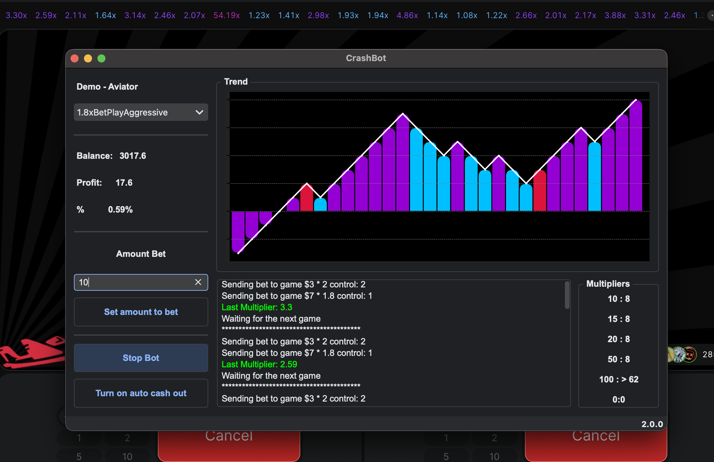
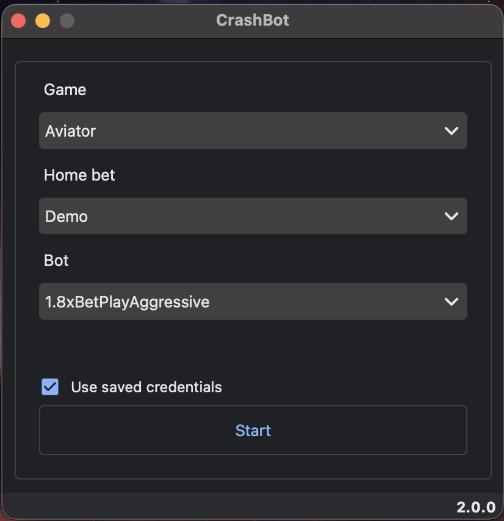
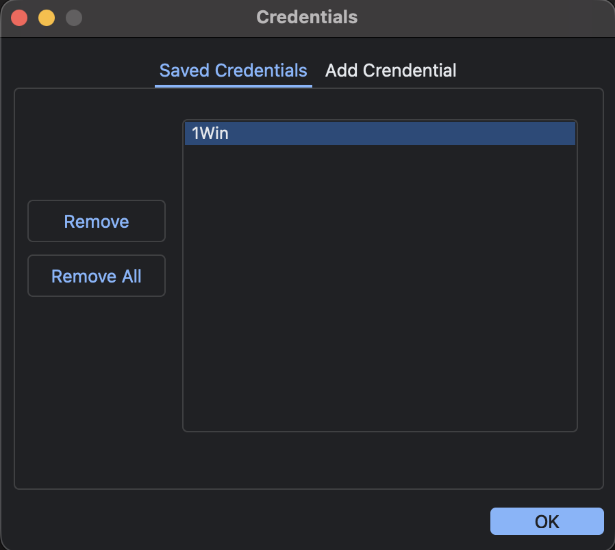
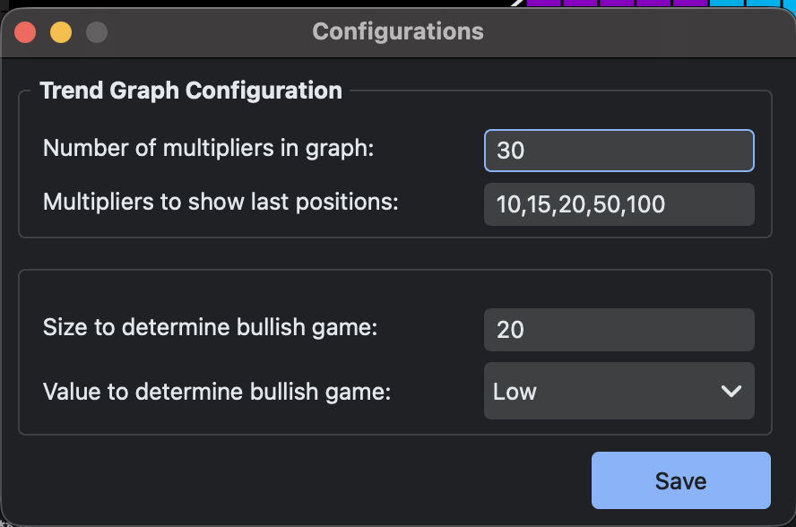
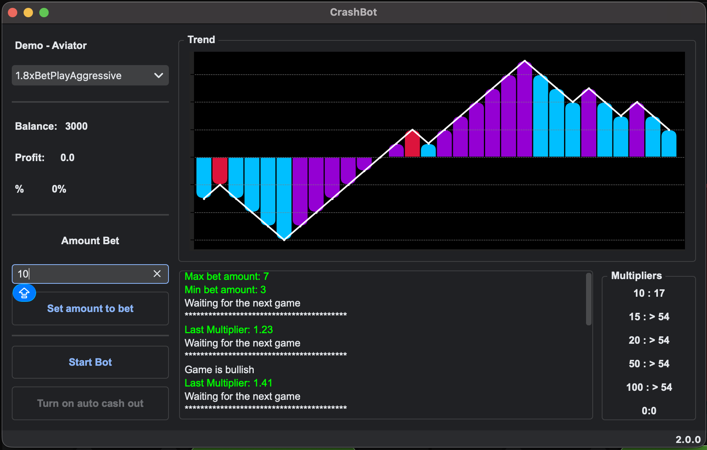
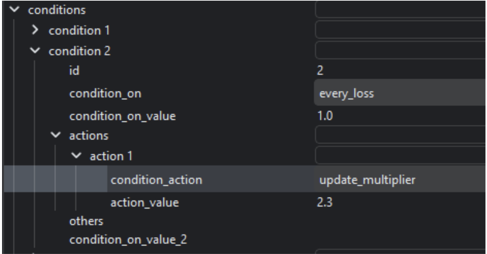
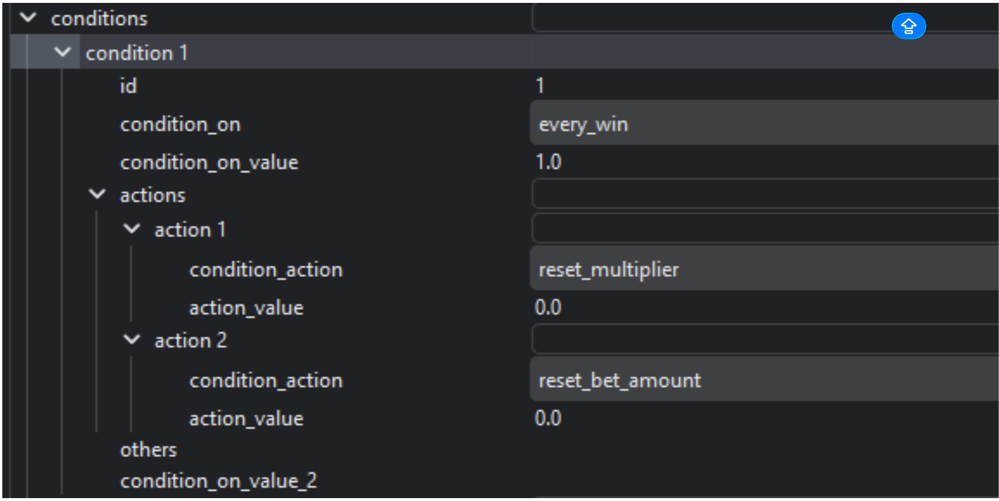
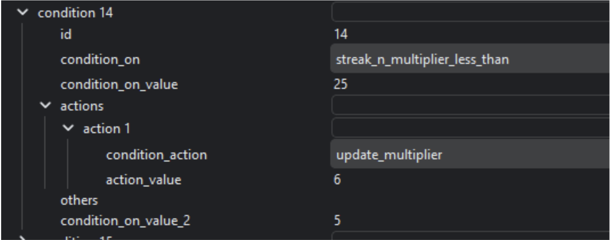

# CrashBot 





> **IMPORTANT DISCLAIMER - EDUCATIONAL PURPOSE ONLY**
>
> This project was created **exclusively for educational and learning purposes**. It is intended to demonstrate programming concepts, software architecture, browser automation, and GUI development with Python.
>
> **This software is NOT intended for real gambling or commercial use.** The author does not encourage, promote, or endorse gambling in any form. The author assumes no responsibility for any use of this software, whether legal or illegal, and expressly disclaims any liability for financial losses, legal consequences, or any other damages arising from its use.
>
> This project has no affiliation with Aviator, Spribe, or any betting house or casino platform. All trademarks and brand names mentioned belong to their respective owners.
>
> **By using this software, you acknowledge that you do so at your own risk and accept full responsibility for any consequences.**

---

CrashBot is a desktop application designed to assist with automated betting on crash-type casino games. These games feature a multiplier that starts at 1x and increases until it randomly "crashes." Players must cash out before the crash to win.

## Key Features

- **AI-Powered Predictions**: ML models evaluated in real-time with accuracy tracking and automatic filtering of underperforming models
- **Two Game Modes**: AI mode (ML predictions + adaptive Kelly criterion) and Strategy mode (deterministic betting rules)
- **Automated Betting**: Configure betting strategies and let the bot place bets automatically
- **Multiple Bookmaker Support**: Works with several online betting platforms (see [Supported Bookmakers](#supported-bookmakers))
- **Backend Integration**: REST API and WebSocket connection for authentication, predictions, and data collection
- **Subscription System**: Plans with and without AI features, managed through user authentication
- **Risk Management**: Built-in stop loss and take profit mechanisms
- **Recovery Strategies**: Intelligent betting adjustments after losses
- **Real-time Monitoring**: Live balance tracking, betting history, and trend charts
- **Custom Strategies**: Create, configure, and load encrypted custom betting bots
- **Data Collection**: Multiplier history and bet data sent to backend for analysis and model training
- **Multi-language Support**: Available in English and Spanish

## How Crash Games Work

1. Each round starts with a multiplier at 1.00x
2. The multiplier increases continuously
3. At a random point, the game "crashes"
4. If you cash out before the crash, you win (bet x multiplier)
5. If the game crashes before you cash out, you lose your bet

---

## Supported Games

| Game | Description |
|------|-------------|
| **Aviator** | Spribe's popular crash game with an airplane theme |
| **To The Moon** | Rocket-themed crash game with similar mechanics |

## Supported Bookmakers

| Bookmaker | Aviator | To The Moon |
|-----------|:-------:|:-----------:|
| Demo | Yes | - |
| BetPlay | Yes | - |
| OneWin | Yes | Yes |
| Rivalo | Yes | - |
| 1xBet | Yes | - |
| ECUABET | Yes | - |
| Demo To The Moon | - | Yes |

> **Note:** Available bookmakers depend on your subscription plan and region.

---

## Game Modes

CrashBot supports two distinct game modes:

| Mode | Description |
|------|-------------|
| **AI Mode** | Uses ML model predictions to determine when to bet and at what multiplier. Models are evaluated in real-time — underperforming models are automatically filtered out. Bet sizing uses an adaptive Kelly criterion. Requires a subscription plan with AI enabled. |
| **Strategy Mode** | Pure strategy-based betting using deterministic rules configured in the bot parameters. No AI predictions — relies on fixed multipliers, conditions, and recovery logic. Available on all plans. |

For more details on the prediction system and model evaluation, see [Technical Documentation](./docs/technical_documentation.md).

---

## Authentication & Subscription

CrashBot connects to a backend service for authentication and feature management:

1. **Login**: Users authenticate with username and password through the login window
2. **Subscription Plans**: Access is managed through plans that may include AI features or strategy-only mode
3. **Session Control**: The backend validates the app version and prevents duplicate sessions
4. **Data Sync**: Multiplier history and bet data are sent to the backend for analysis and model improvement

> **Note:** A valid account and active subscription are required to use the application.

---

## Architecture Overview

```
GUI (PyQt6) ←→ SocketIO ←→ WebSocket Server ←→ Game Logic ←→ Bot ←→ Playwright Scraper
                                                   ↑                        ↑
                                            Prediction API           Bookmaker Website
                                                   ↑
                                           Backend REST API
                                                   ↑
                                    Auth / Subscription / Data Collection
```

For detailed architecture diagrams, class hierarchies, and design patterns, see [Architecture Documentation](./docs/architecture.md) and [Technical Documentation](./docs/technical_documentation.md).

---

## Documentation

For more detailed information about the project, please refer to:

| Document | Description |
|----------|-------------|
| [Architecture](./docs/architecture.md) | Component diagrams, data flows, class hierarchies, and design patterns |
| [Technical Documentation](./docs/technical_documentation.md) | Detailed technical reference, API integrations, and development guide |
| [User Manual (Spanish)](./docs/manual_es.md) | Complete user guide in Spanish |

---

## System Requirements

### Minimum Requirements

| Component | Requirement |
|-----------|-------------|
| Operating System | Windows 10+, macOS 10.14+, or Linux (Ubuntu 18.04+) |
| Python | Version 3.10 or higher |
| RAM | 4 GB minimum |
| Storage | 500 MB free space |
| Internet | Stable broadband connection |
| Display | 1280x720 minimum resolution |

### Software Dependencies

- Python 3.10+
- Chromium browser (automatically installed via Playwright)
- Key libraries: PyQt6, Playwright, requests, cryptography, websocket-client, python-socketio
- Valid account on supported bookmaker platforms
- Active CrashBot subscription

---

## Installation Guide

### Step 1: Install Python

If you do not have Python installed:

1. Visit [python.org](https://www.python.org/downloads/)
2. Download Python 3.10 or newer
3. Run the installer
4. **Important**: Check "Add Python to PATH" during installation

### Step 2: Download CrashBot

Download the CrashBot application files and extract them to your desired location.

### Step 3: Install Dependencies

Open a terminal or command prompt in the CrashBot directory:

```bash
# Create a virtual environment (recommended)
python -m venv .venv

# Activate the virtual environment
# On Windows:
.venv\Scripts\activate
# On macOS/Linux:
source .venv/bin/activate

# Install required packages
pip install -r requirements.txt
```

### Step 4: Install Browser

Install the Playwright Chromium browser:

```bash
playwright install chromium
```

### Step 5: Verify Installation

Run CrashBot to verify everything is installed correctly:

```bash
python crashbot.py
```

The application window should appear with a dark theme.

---

## Creating an Executable

You can create a standalone executable to distribute CrashBot without requiring users to install Python.

### Prerequisites

Install the required tools:

```bash
pip install -r requirements_installer.txt
```

This installs:
- **PyInstaller**: Bundles Python applications into executables
- **PyArmor**: Obfuscates the code for protection

### Build Process

Run the following command:

```bash
make generate-installer
# or: python create_executable.py
```

### Build Options

During the build process, you'll be prompted to choose the output format:

| Option | Description | Platform |
|--------|-------------|----------|
| **One-file** | Single executable file with all dependencies bundled | Windows, Linux |
| **Multi-file** | Directory with executable and supporting files | All platforms |

> **Note:** The one-file option is not available on macOS due to platform limitations.

### Output

After the build completes, you'll find the output in:

| Build Type | Location |
|------------|----------|
| One-file | `dist/crashbot.exe` (Windows) or `dist/crashbot` (Linux) |
| Multi-file | `dist/crashbot/` directory |

The build process automatically includes:
- Localization files (`locales/`)
- Custom bots (`custom_bots/`)
- Configuration template (`conf.ini`)
- Application icon

### Distribution

For one-file builds, distribute:
- The executable file
- `locales/` folder
- `custom_bots/` folder
- `conf.ini`

For multi-file builds, distribute the entire `dist/crashbot/` directory.

---

## CrashBot Application

### Login

When the application starts, a login window is displayed. Enter your username and password to authenticate with the backend service. Upon successful login, your subscription plan is loaded and the main application becomes available.

---

### Betting House and Bot Configuration



On this screen you must configure:

| Element | Description |
|---------|-------------|
| **Game** | Game to play |
| **Betting house** | Only enabled houses in your service will appear |
| **Bot type** | Service bots and your custom bots |
| **Use saved credentials** | Automatic login with stored credentials |
| **Start** | Button to initialize the game and bot |

> **Warning:** Using automatic login is not recommended as betting houses could detect that you are using a bot.

---

### Change Language

**Menu:** Configuration → Language

When you change the language, you need to restart the application for the changes to take effect.

---

### Credentials

**Menu:** Configuration → Credentials

Screen to save your betting house credentials.

#### Tab: Saved Credentials



| Element | Description |
|---------|-------------|
| Credentials list | Stored credentials |
| Delete button | Deletes the selected credential |
| Delete all button | Deletes all credentials |
| Close button | Closes the screen |

#### Tab: Add Credential


| Field | Description |
|-------|-------------|
| Betting house | Select the betting house |
| Username | Your username |
| Password | Your password |
| Save button | Saves the credential |

> **Note:** Automatic login is not recommended to prevent the betting house from recognizing repetitive behaviors.

---

### Parameters

**Menu:** Configuration → Parameters



| Parameter | Description |
|-----------|-------------|
| **Number of rounds in the chart** | Maximum number of rounds the chart will display. It is recommended to configure before starting the game |
| **Multipliers to display** | Multipliers to show in the main screen panel. Format: values separated by commas without spaces (e.g.: `2,5,10,20`) |
| **Size to determine bullish game** | Sample size of multipliers to determine bullish trend |
| **Value to determine bullish game** | Sensitivity to detect bullish trend (low, medium, high). Higher value = higher slope required |

---

### Configure Bots

**Menu:** Configuration → Bots

Screen to create and modify custom bots.


| Element | Description |
|---------|-------------|
| **Selected Bot** | Selector for the bot to modify |
| **New Button** | Creates a new bot with default parameters |
| **Clone Button** | Clones the selected bot |
| **Save Button** | Saves the new or modified bot |
| **Bot configurations** | Section to configure parameters |
| **Errors Section** | Shows errors when trying to save |

---

### Main Screen

Screen where the user interacts with the bot during the game.



#### Top Panel

| Element | Description |
|---------|-------------|
| **Betting house** | Current house name |
| **Selected bot** | Bot in use |
| **Balance** | Current balance (updates with each bet) |
| **Profit** | Profit over the initial session amount |
| **Percentage** | Profit percentage |

#### Betting Controls

| Control | Description |
|---------|-------------|
| **Amount to bet** | Amount to bet per round |
| **Select bet** | Sends the amount to the bot (will be reflected in the logs) |
| **Start/Stop Bot** | Starts or stops automatic betting |
| **Enable/Disable automatic cashout** | Controls automatic withdrawal |

#### Trend Chart

Displays the trend of multipliers (updates automatically after each round).

**Bar colors:**

| Color | Meaning |
|-------|---------|
| Blue | Multiplier less than 2x |
| Purple | Multiplier between 2x and 10x |
| Red | Multiplier greater than 10x |

> **Tip:** Hover the mouse over the bars to see the exact multiplier of each round.

#### Multipliers Panel

Shows how many rounds ago each multiplier appeared.

**Format:** `[Multiplier] → [Rounds]`

**Example:** `10 → 3` means a 10x or higher multiplier appeared 3 rounds ago.

> **Note:** If `> 25` appears, it means there is no recent record of that multiplier.

#### Logs

Bot messages for tracking execution.

---

## Bots

There are two types of bots:

- **Official bots:** Default bots, available to all users
- **Custom bots:** Created by users with configurable behaviors

> **Recommendation:** Before playing with real money, verify the behavior of the bots. You can use the "demo" betting house to simulate a real game.

---

### General Behavior

When you select an amount to bet, it is divided into two bets:

| Bet | Proportion | Description |
|-----|------------|-------------|
| **Main (safe)** | 2/3 of the amount | Lower multiplier |
| **Secondary (for value)** | 1/3 of the amount | Higher multiplier |

**Example:** If you bet $3 USD → Main bet: $2, Secondary bet: $1

#### Loss Recovery

When a bet is lost:
1. The bot places **a single bet** to recover the lost money
2. Once recovered, it returns to making the two normal bets

---

### Custom Bots

**Location:** `custom_bots/` inside the CrashBot folder

To create custom bots use the **Bot Configuration** screen.


---

### Bot Parameters

#### General Parameters

| Parameter | Type | Description |
|-----------|------|-------------|
| `name` | string | Bot name |
| `description` | string | Bot description |
| `bot_type` | string | Bot type: `aggressive`, `tight` or `loose` |
| `number_of_min_bets_allowed_in_bank` | int | Minimum number of bets allowed in balance to use the bot |
| `only_bullish_games` | bool | If the bot only plays when the game is bullish |
| `make_second_bet` | bool | If it makes two bets (safe and value) or only one |

#### Multiplier Parameters

| Parameter | Type | Description |
|-----------|------|-------------|
| `min_multiplier_to_bet` | decimal | Main bet multiplier |
| `min_multiplier_to_recover_looses` | decimal | Multiplier to recover losses |
| `max_second_multiplier` | decimal | Maximum multiplier for the second bet (0 = use prediction) |

#### Risk Parameters

| Parameter | Type | Range | Description |
|-----------|------|-------|-------------|
| `risk_factor` | decimal | 0-1 | Factor to increase bets according to situation |
| `max_recovery_percentage_on_max_bet` | decimal | 0-1 | Maximum percentage of maximum bet for recovery |
| `stop_loss_percentage` | decimal | - | % of loss over balance to stop the bot |
| `take_profit_percentaje` | decimal | - | % of profit over balance to stop the bot |

#### AI Parameters

> **Note:** These parameters only apply to bots that use artificial intelligence. For strategy bots, these values are ignored.

| Parameter | Type | Range | Description |
|-----------|------|-------|-------------|
| `min_probability_to_bet` | decimal | 0-1 | Minimum prediction probability to bet |
| `min_category_percentage_to_bet` | decimal | 0-1 | Minimum category probability to bet |
| `min_average_model_prediction` | decimal | 0-1 | Minimum average of correct model predictions |

---

### Conditions

Conditions define when the bot should execute certain actions.

#### Condition Types (`condition_on`)

| Condition | Description | `condition_on_value` | `condition_on_value_2` |
|-----------|-------------|----------------------|------------------------|
| `every_win` | Every time you win | (ignored) | - |
| `every_loss` | Every time you lose | (ignored) | - |
| `streak_wins` | Streak of X wins | Number of wins (int) | - |
| `streak_losses` | Streak of X losses | Number of losses (int) | - |
| `profit_greater_than` | Profit greater than X% | Percentage (decimal) | - |
| `profit_less_than` | Profit less than X% | Percentage (decimal) | - |
| `streak_n_multiplier_less_than` | Streak of N multipliers < X | N (quantity) | X (multiplier) |
| `streak_n_multiplier_greater_than` | Streak of N multipliers > X | N (quantity) | X (multiplier) |

---

### Actions

Actions define what the bot does when a condition is met.

#### Action Types (`condition_action`)

| Action | Description | `action_value` |
|--------|-------------|----------------|
| `increase_bet_amount` | Increases the bet by X% | Percentage |
| `decrease_bet_amount` | Decreases the bet by X% | Percentage |
| `reset_bet_amount` | Resets the bet to the original value | 0 (ignored) |
| `update_multiplier` | Updates the multiplier | New multiplier |
| `reset_multiplier` | Resets the multiplier to the original | 0 (ignored) |
| `ignore_model` | Ignores AI model filters | 0=don't ignore, 1=ignore |
| `make_bet` | Controls if it bets on the next round | 0=don't bet, 1=bet |
| `forget_losses` | Forgets current losses | 0=no, 1=yes |
| `recovery_losses` | Controls loss recovery | 0=don't recover, 1=recover |

---

### Configuration Examples

#### Example 1: Change multiplier on loss

**Objective:** Every time a bet is lost, update the multiplier to 2.3x and reset the amount.



#### Example 2: Restore configuration on win

**Objective:** On win, return to the initial configuration.



#### Example 3: React to streak of low multipliers

**Objective:** After 25 consecutive multipliers less than 5x, increase the multiplier to 6x.



**Explanation:**
- `condition_on_value`: 25 (number of multipliers in streak)
- `condition_on_value_2`: 5 (multiplier value for the condition)
- `action_value`: 6 (new multiplier)

---

## Glossary

| Term | Definition |
|------|------------|
| **Bank** | Player's total balance |
| **Profit** | Accumulated profit/loss in the session |
| **Bullish** | Trend of high multipliers |
| **Safe** | Main bet with low multiplier |
| **For value** | Secondary bet with high multiplier |
| **Stop loss** | Loss limit to stop the bot |
| **Take profit** | Profit limit to stop the bot |

## Troubleshooting

### Common Issues

#### Application Won't Start

**Symptoms**: No window appears, error messages

**Solutions**:
1. Verify Python 3.10+ is installed: `python --version`
2. Check all dependencies are installed: `pip install -r requirements.txt`
3. Verify `config/app_data.json` exists and is valid JSON
4. Check console for error messages

#### Browser Won't Open

**Symptoms**: Bot starts but no browser window appears

**Solutions**:
1. Reinstall Playwright browser: `playwright install chromium`
2. Check system resources (RAM, CPU)
3. Verify internet connection
4. Try closing other browser instances

#### Connection Issues

**Symptoms**: Cannot connect to bookmaker

**Solutions**:
1. Verify bookmaker URL is correct in `config/app_data.json`
2. Check your internet connection
3. Verify bookmaker website is accessible
4. Check if VPN is required for your region

#### Bot Not Placing Bets

**Symptoms**: Bot is running but not betting

**Possible Causes**:
1. **Stop loss reached**: Check if you hit your stop loss limit
2. **Take profit reached**: Check if you hit your profit target
3. **Only bullish mode**: Market may be "bearish"
4. **Bet amount not set**: Ensure you set the max amount
5. **Condition triggered**: A bot condition may have set bet to 0

**Solutions**:
1. Check log messages for specific reasons
2. Verify bet amount is set
3. Check bot configuration and conditions
4. Restart the session if needed

#### Incorrect Balance Display

**Symptoms**: Displayed balance doesn't match bookmaker

**Solutions**:
1. The app reads balance from the game interface
2. Wait for balance to sync after bets settle
3. Refresh the page if issue persists

### Error Messages

| Error | Meaning | Solution |
|-------|---------|----------|
| "Config file not found" | Missing app_data.json | Create config/app_data.json |
| "No bot data found" | Bot not loaded | Check custom_bots directory |
| "Currency not found" | Currency mismatch | Check limits in app_data.json |
| "Stop loss reached" | Hit loss limit | Restart session or adjust limit |

### Getting Debug Information

Enable debug mode for more detailed logs:

1. Open `conf.ini`
2. Add: `DEBUG=1`
3. Restart the application
4. Check logs for detailed information

---

## FAQ

### General Questions

**Q: Is CrashBot guaranteed to make money?**

A: No. Crash games are games of chance with a house edge. CrashBot is a tool to automate betting strategies, but it cannot predict or guarantee outcomes. Always gamble responsibly.

**Q: Which bookmaker should I use?**

A: CrashBot supports multiple bookmakers. Choose one that is legal in your jurisdiction and offers the games you want to play.

**Q: Can I use CrashBot on multiple accounts?**

A: CrashBot runs one instance at a time. Running multiple instances may work but is not officially supported and may violate bookmaker terms of service.

### Technical Questions

**Q: Why does the browser open in non-headless mode?**

A: The browser needs to be visible to properly interact with the game interface. Some games use anti-bot measures that headless browsers cannot bypass.

**Q: Can I minimize the browser window?**

A: You can minimize it, but some game elements may not update properly. It's recommended to keep the window visible.

**Q: How much RAM does CrashBot use?**

A: CrashBot itself uses minimal RAM (~100-200MB), but the Chromium browser adds significant usage (~500MB-1GB depending on the game).

### Bot Questions

**Q: What's the best bot configuration?**

A: There's no universally "best" configuration. Start with conservative settings (low risk factor, reasonable stop loss) and adjust based on your experience and risk tolerance.

**Q: Why does the bot sometimes skip rounds?**

A: The bot may skip rounds due to:
- Market conditions (if "only bullish" is enabled)
- Recovery mode calculations
- Stop loss/take profit limits
- Bot conditions triggered that skip bets

**Q: How do I create my own bot?**

A: Create a JSON configuration file with your desired parameters, then convert it to encrypted format using the provided tools. See the Custom Bots section for details.

### Safety Questions

**Q: Are my credentials secure?**

A: Credentials are stored locally on your machine and are not transmitted anywhere. However, always use unique passwords and be cautious about where you run the application.

**Q: Can the bookmaker detect I'm using a bot?**

A: Possibly. Automated betting tools may violate bookmaker terms of service. Use at your own risk and be aware of potential account restrictions.

---

## Disclaimer

### Legal Notice

CrashBot is provided "as is" without warranty of any kind, express or implied. The author is not responsible for any financial losses, legal consequences, or damages arising from the use of this software.

### Terms of Use

By using CrashBot, you acknowledge that:

1. This software is for **educational purposes only**
2. You accept full responsibility for any use of this software
3. You will not hold the author liable for any losses or legal issues
4. Automated betting may violate bookmaker terms of service
5. You understand gambling involves risk with no guaranteed outcomes

### Risk Acknowledgment

- Past performance does not guarantee future results
- Stop loss mechanisms cannot prevent all losses
- Software bugs may cause unexpected behavior
- Network issues may affect bet execution

### Gambling Warning

- Gambling can be addictive. Play responsibly.
- Only gamble with money you can afford to lose.
- If you have a gambling problem, seek help from a professional organization.
- Gambling may be illegal in your jurisdiction. Know your local laws.

---
