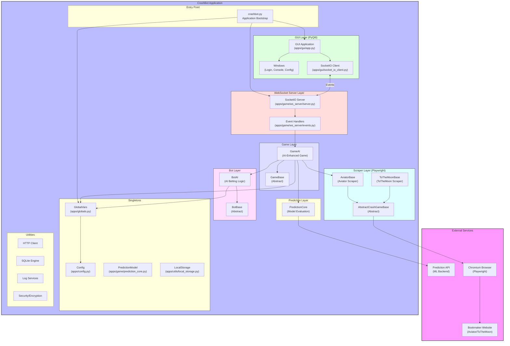
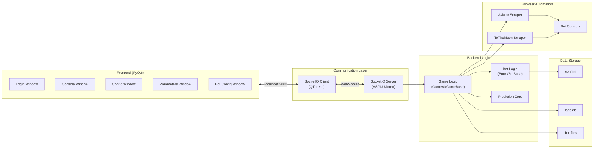
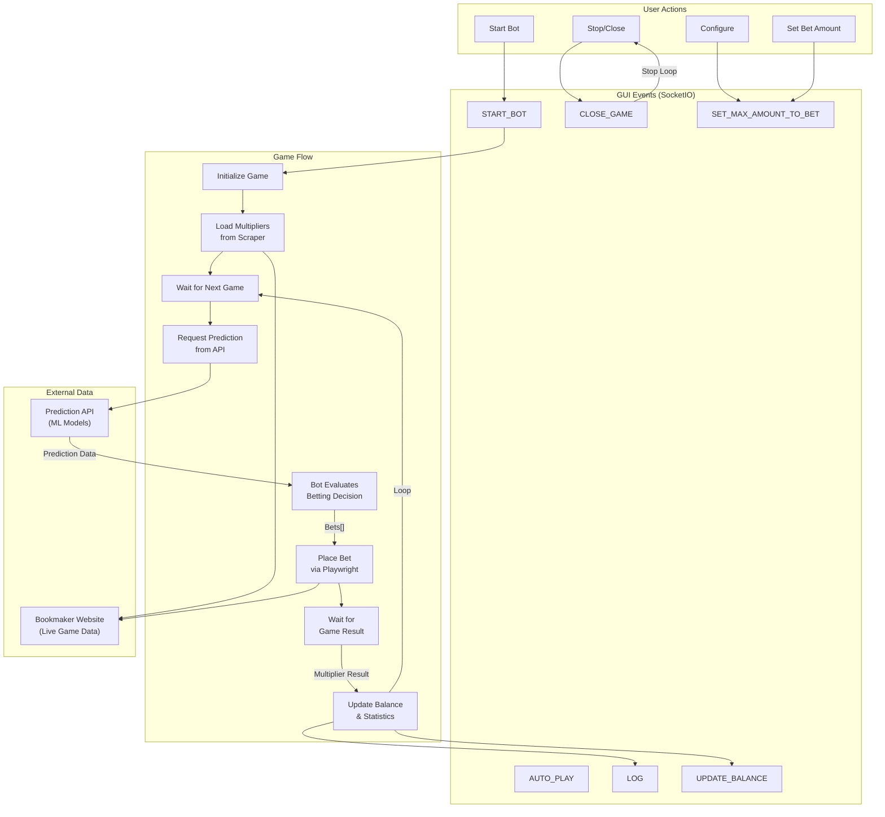
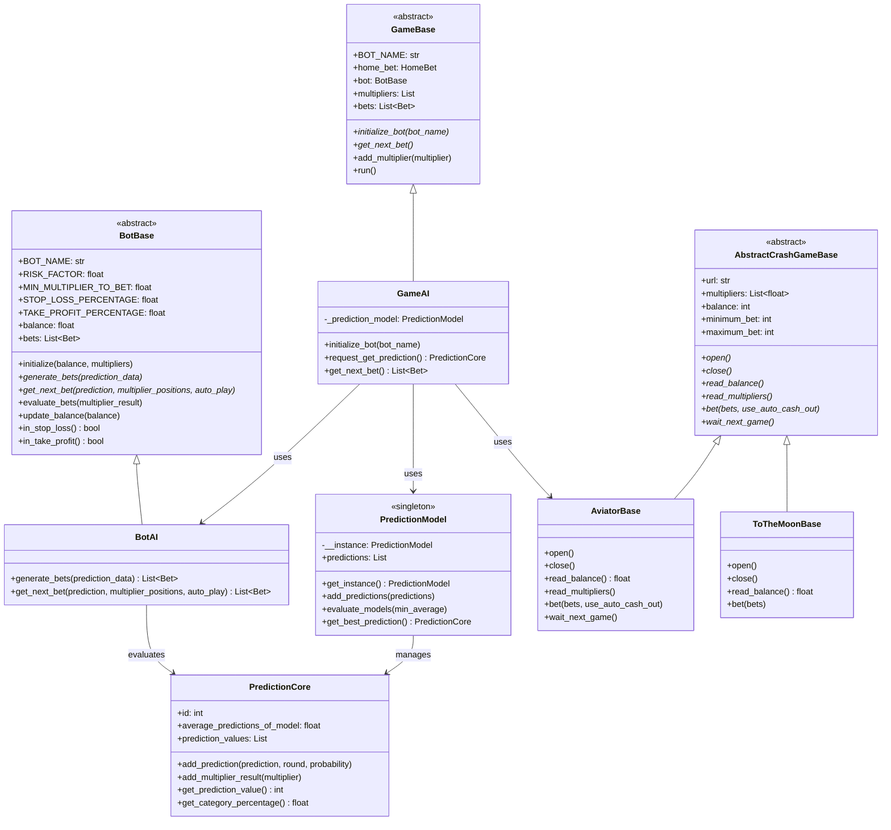
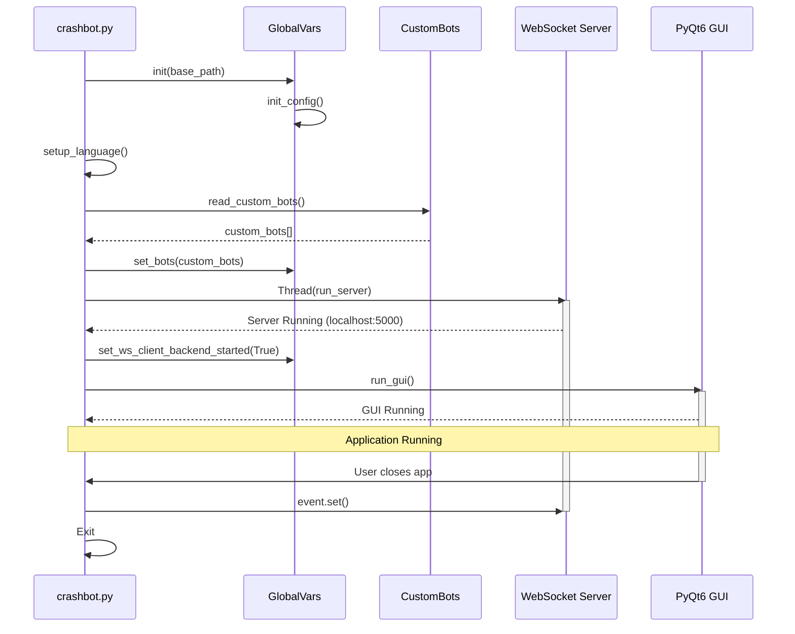
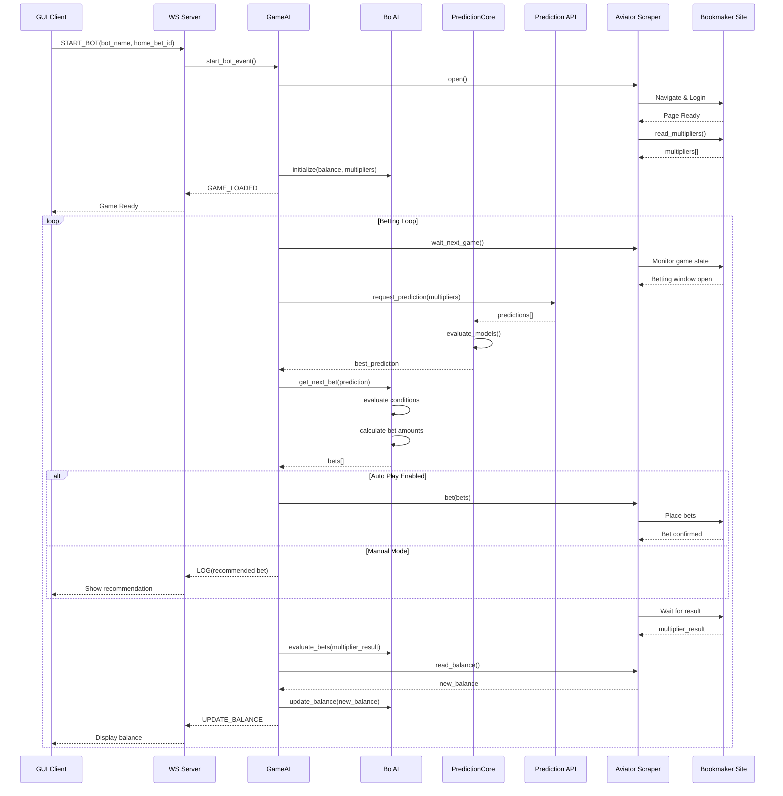
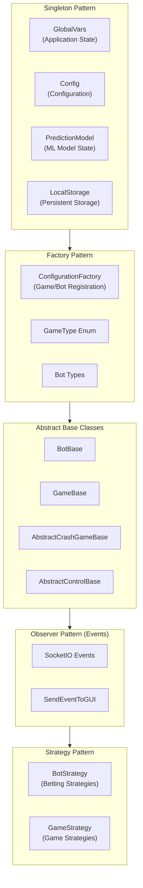
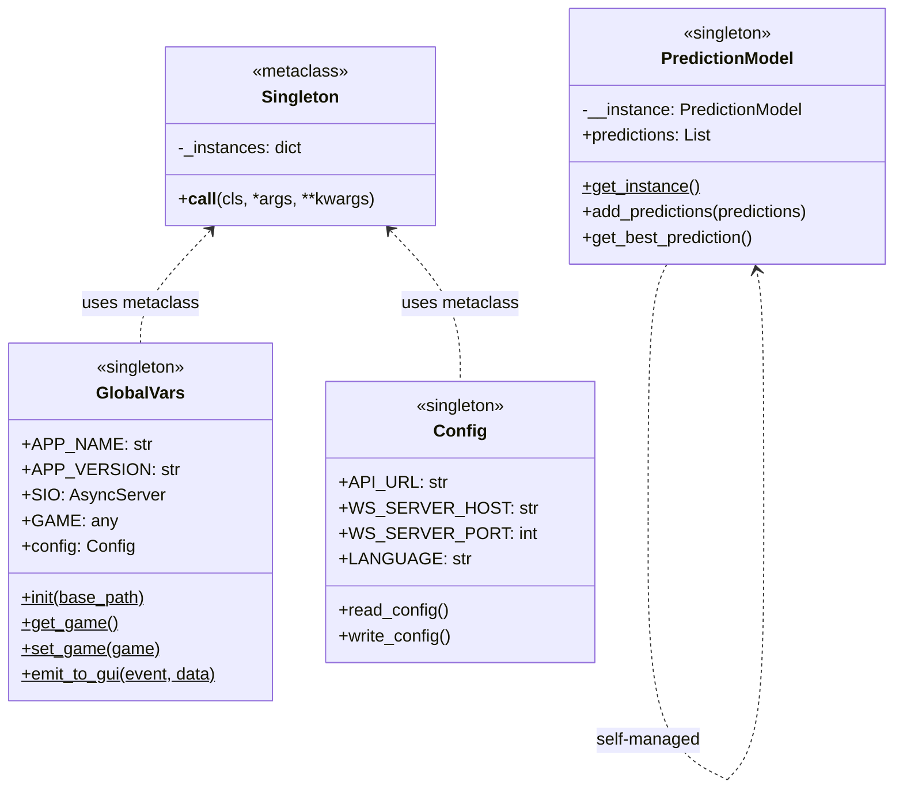

# CrashBot Architecture

This document provides a comprehensive overview of the CrashBot application architecture, including component relationships, data flows, and design patterns.

## Table of Contents

- [High-Level Architecture](#high-level-architecture)
- [Component Diagram](#component-diagram)
- [Data Flow Diagram](#data-flow-diagram)
- [Class Hierarchy](#class-hierarchy)
- [Sequence Diagrams](#sequence-diagrams)
- [Design Patterns](#design-patterns)

---

## High-Level Architecture



---

## Component Diagram



---

## Data Flow Diagram



---

## Class Hierarchy



---

## Sequence Diagrams

### Application Startup



### Betting Cycle



---

## Design Patterns

### Pattern Overview



### Singleton Implementation



---

## Directory Structure

```
crashbot/
+-- crashbot.py              # Entry point
+-- conf.ini                 # Configuration file
+-- apps/
|   +-- config.py            # Config singleton
|   +-- globals.py           # GlobalVars singleton
|   +-- constants.py         # Application constants
|   +-- ws_client.py         # WebSocket client (unused)
|   +-- api/                 # External API services
|   |   +-- services.py      # API request functions
|   |   +-- models.py        # API data models
|   +-- custom_bots/         # Custom bot loading
|   |   +-- services.py      # Bot file parsing
|   |   +-- handlers.py      # Bot handlers
|   +-- game/
|   |   +-- bots/
|   |   |   +-- bot_base.py  # Abstract bot class
|   |   |   +-- bot_ai.py    # AI betting bot
|   |   |   +-- bot_strategy.py
|   |   +-- games/
|   |   |   +-- game_base.py # Abstract game class
|   |   |   +-- game_ai.py   # AI-enhanced game
|   |   +-- ws_server/
|   |   |   +-- server.py    # SocketIO ASGI server
|   |   |   +-- events.py    # Event handlers
|   |   +-- prediction_core.py # ML model evaluation
|   |   +-- models.py        # Game data models
|   +-- gui/
|   |   +-- app.py           # PyQt6 application
|   |   +-- socket_io_client.py # SocketIO client thread
|   |   +-- gui_events.py    # GUI event helpers
|   |   +-- windows/         # PyQt6 window classes
|   +-- scrappers/
|   |   +-- game_base.py     # Abstract scraper class
|   |   +-- aviator/
|   |   |   +-- aviator_base.py    # Core Aviator automation
|   |   |   +-- aviator_*.py       # Bookmaker variants
|   |   |   +-- bet_control.py     # Bet control automation
|   |   +-- to_the_moon/
|   +-- utils/
|       +-- patterns/
|       |   +-- singleton.py # Singleton metaclass
|       |   +-- factory.py   # Factory pattern
|       +-- local_storage.py # Key-value storage
|       +-- sqlite_engine.py # SQLite wrapper
|       +-- logs/            # Logging services
+-- custom_bots/             # Encrypted .bot files
+-- locales/                 # i18n translations
+-- data/                    # Runtime data (logs.db)
```

---

## Technology Stack

| Layer | Technology | Purpose |
|-------|------------|---------|
| GUI | PyQt6 + pyqtdarktheme | Desktop user interface |
| Communication | SocketIO (python-socketio) | Real-time GUI-backend messaging |
| Server | Uvicorn (ASGI) | WebSocket server hosting |
| Browser Automation | Playwright | Web scraping and betting automation |
| HTTP Client | requests/aiohttp | API communication |
| Database | SQLite | Local logging and storage |
| Configuration | INI files | User settings |
| Translations | gettext | Multi-language support (en/es) |

---

## Key Configuration

### conf.ini Settings

| Setting | Description | Default |
|---------|-------------|---------|
| `API_URL` | Prediction API endpoint | `http://localhost:8000` |
| `WS_SERVER_HOST` | Local WS server host | `localhost` |
| `WS_SERVER_PORT` | Local WS server port | `5000` |
| `LANGUAGE` | UI language (en/es) | `en` |
| `MAX_AMOUNT_HOME_BET_PERCENTAGE` | Max bet % of home bet limit | `0.5` |
| `MAX_AMOUNT_BALANCE_PERCENTAGE` | Max bet % of balance | `0.005` |
| `MIN_VALUE_TO_BULLISH_GAME` | Slope threshold for bullish detection | `0.26` |
| `LEN_WINDOW_TO_BULLISH_GAME` | Window size for trend analysis | `6` |

---

## Event Reference

### WebSocket Events (GUI <-> Server)

| Event | Direction | Description |
|-------|-----------|-------------|
| `LOGIN` | GUI -> Server | Authenticate user |
| `VERIFY` | GUI -> Server | Verify session |
| `START_BOT` | GUI -> Server | Start betting bot |
| `AUTO_PLAY` | Bidirectional | Toggle auto-betting |
| `CLOSE_GAME` | GUI -> Server | Stop bot and close browser |
| `SET_MAX_AMOUNT_TO_BET` | Bidirectional | Update bet amount |
| `LOG` | Server -> GUI | Send log message |
| `UPDATE_BALANCE` | Server -> GUI | Update balance display |
| `GAME_LOADED` | Server -> GUI | Game ready notification |
| `ERROR` | Server -> GUI | Error notification |
| `EXCEPTION` | Server -> GUI | Exception notification |
| `ADD_MULTIPLIERS` | Server -> GUI | Send multiplier history |
